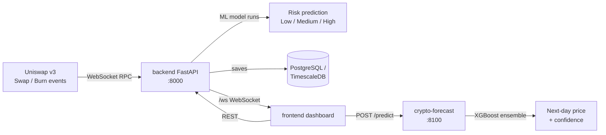

# DEX Liquidity Predictor

A dark, "Bloomberg-terminal" style dashboard that watches Uniswap V3 pools,
predicts when liquidity is about to drain, and forecasts next-day BTC/ETH prices
— all in one place.

Think of it as a cockpit for DeFi traders: instead of staring at raw blockchain
logs, you get a live feed, a risk score, a chart, and a plain-English explanation
of what's going on.

---

## What is this, in plain English?

This is not one app — it's **three small apps that talk to each other**:

| Piece | What it is | What it does |
| ----- | ---------- | ------------ |
| `frontend/` | Next.js dashboard | The UI you see in the browser |
| `backend/` | FastAPI service | Watches Uniswap pools, predicts liquidity drain, pushes alerts |
| `crypto-forecast/` | FastAPI microservice | Predicts tomorrow's BTC/ETH price with a machine-learning model |

The frontend is the only thing a human interacts with. The two Python services do
the heavy lifting behind the scenes.

> **Fun fact:** the folder is a Laravel skeleton, but Laravel is only used as a
> dumb file server. The real product is the static frontend + the two Python
> services. Apache/XAMPP just serves the built dashboard.

---

## The big picture

Here's how a piece of information travels through the system:



1. The backend listens to the blockchain for `Swap` and `Burn` events.
2. Every event is run through a machine-learning model that estimates how much
   liquidity is draining and what the price impact is.
3. The result is saved to the database and broadcast to the dashboard in real time.
4. Separately, the dashboard can ask the price-forecast service "what will BTC
   cost tomorrow?" and get back a number with a confidence score.

---

## How the dashboard works (`frontend/`)

Built with **Next.js 14** (App Router) + **React 18** + **Tailwind CSS** +
**lightweight-charts**. It's a single page with a sidebar — clicking a nav item
swaps the main content area. No routing, no server; the whole thing compiles to
static files.

The views:

- **Dashboard** — live snapshot of the watched pool, price, liquidity, risk, and a
  scrolling event log.
- **Pools** — list of watched pools with their current numbers.
- **Predictions** — the AI's latest drain/price-impact calls per event.
- **Price Prediction** — a form (prefilled with **today's real data**) that asks
  the forecast service for tomorrow's BTC/ETH price, with confidence and a 95%
  range.
- **Alerts** — warnings that cross a risk threshold.
- **Settings** — WebSocket/API URLs and theme controls.

The **WebSocket** (`/ws`) is handled by a small `useWebSocket` hook. When a message
arrives, the dashboard re-renders instantly — that's why the numbers tick without
a page refresh.

The **charts** use `lightweight-charts` for the time-series (price/liquidity),
drawn in the same black-and-accent theme as the rest of the UI.

### The "Noir" theme

The whole UI uses CSS variables (`--noir-accent`, `--noir-panel`, …) so the accent
color can be swapped at runtime. Open **Settings** and pick amber, green, cyan,
red, magenta, or white — every panel updates instantly. Fonts are JetBrains Mono
for that terminal feel, and corners are deliberately 0px.

---

## How the DEX backend works (`backend/`)

FastAPI + Web3.py + scikit-learn/XGBoost. Its job: **turn raw blockchain noise
into a risk signal**.

The pipeline:

1. **Listen** — subscribes to a Uniswap V3 pool's `Swap` and `Burn` events over a
   WebSocket RPC connection (`RPC_URL_WS`).
2. **Decode** — parses each log into a readable object (amounts, tick, hash).
   Wei amounts are kept as strings so JavaScript doesn't lose precision on big
   numbers.
3. **Predict** — `LiquidityPredictor` loads a trained model (`LIQUIDITY_MODEL_PATH`)
   and outputs `predicted_drain_percentage`, `predicted_price_impact`, and a
   `risk_level` (Low / Medium / High). If no model file exists, it falls back to a
   transparent rule-based heuristic so the dashboard still works.
4. **Store** — saves the metric into PostgreSQL (TimescaleDB for time-series) via
   `save_metrics_to_db`.
5. **Broadcast** — pushes the event + prediction to every `/ws` client.

REST endpoints include `/api/v1/pools`, `/api/v1/predictions`, a price-impact
simulator, and `/api/v1/metrics/{pool_address}` which returns the last 100 points
in a format the chart can plot directly.

There's also a small user layer (register with bcrypt-hashed passwords) built with
SQLAlchemy 2.0.

### Running without a blockchain node

`MOCK_MODE=true` (the default) makes the backend generate synthetic pool, price,
and mempool data — so the entire dashboard runs **completely offline**. Flip it to
`false` and fill in real RPC URLs to watch mainnet.

---

## How the price forecast works (`crypto-forecast/`)

A supervised machine-learning microservice that answers "what will BTC/ETH cost
tomorrow?".

The model is an **ensemble of two gradient-boosted tree models** — XGBoost (300
trees) and HistGradientBoosting — averaged together:

```
ŷ = (xgb(x) + hgb(x)) / 2
```

It's trained on ~4 years of daily data: crypto OHLCV, S&P 500, the US Dollar Index
(DXY), gold, the 10-year Treasury yield, and a Geopolitical Risk (GPR) index. The
target is tomorrow's closing price, and the train/test split is chronological
(train on the past, test on the future) so there's no cheating.

What the `/predict/{ticker}` endpoint returns:

- **Predicted price** — the ensemble's best guess.
- **Confidence** — how closely the two models agree, scaled by typical error.
- **95% range** — `ŷ ± 1.96 × RMSE`, a "give or take" band.
- **Model quality** — R², RMSE, and MAE from the held-out test set.

The dashboard's Price Prediction tab also pulls `/latest/{ticker}` to prefill the
form with **today's actual numbers**, so you don't have to type anything.

> The model is a statistical estimate from historical patterns — it is **not**
> financial advice and will not predict a black-swan event.

---

## Running it locally (Windows)

Three terminals, three services:

### 1. DEX backend (port 8000)

```powershell
cd backend
python -m venv .venv
.venv\Scripts\activate          # or use your system Python 3.11
pip install -r requirements.txt
copy .env.example .env          # MOCK_MODE=true by default
python -m uvicorn app.main:app --reload --port 8000
```

Interactive API docs: http://localhost:8000/docs

### 2. Price forecast service (port 8100)

```powershell
cd crypto-forecast
pip install -r requirements.txt
python train.py --ticker btc
python train.py --ticker eth
python -m uvicorn main:app --host 127.0.0.1 --port 8100
```

Training fetches data from Yahoo Finance + the GPR index and saves the models to
`crypto-forecast/models/`. (Data is cached for a day in `crypto-forecast/data/`.)

### 3. Dashboard (dev mode, port 3000)

```powershell
cd frontend
npm install
copy .env.example .env.local    # set NEXT_PUBLIC_WS_URL, API_URL, FORECAST_URL
npm run dev
```

Open http://localhost:3000

### Deploying to Apache/XAMPP (the way this repo is set up)

The dashboard is a static export, so it builds to plain HTML/JS and gets copied
into `public/`:

```powershell
cd frontend
npm run build
$pub = "..\public"
if (Test-Path "$pub\_next") { Remove-Item "$pub\_next" -Recurse -Force }
Copy-Item "out\index.html","out\404.html" -Destination $pub -Force
Copy-Item "out\_next" -Destination $pub -Recurse -Force
```

Then visit http://localhost/dex-liquidity-predictor/public/

---

## Project structure

```
dex-liquidity-predictor/
├── frontend/            # Next.js dashboard (the UI)
│   ├── app/page.tsx     # single page + view switching
│   ├── components/      # Sidebar, charts, views, theme, explainers
│   └── out/             # static export output (after `npm run build`)
├── backend/             # FastAPI DEX service (events → ML → alerts)
│   ├── app/
│   │   ├── main.py      # app entry, CORS, /ws
│   │   ├── api/         # REST routes
│   │   ├── db/          # SQLAlchemy models, schemas, CRUD
│   │   ├── ml/          # liquidity-drain model + predictor
│   │   ├── services/    # web3, pool provider, price impact, events
│   │   └── tasks/       # background monitoring loop
│   ├── scripts/train_model.py
│   └── tests/
├── crypto-forecast/     # BTC/ETH next-day price prediction service
│   ├── train.py         # fetch → features → train → save
│   ├── main.py          # /health, /latest/{ticker}, /predict/{ticker}
│   ├── model.py         # XGBoost+HistGB ensemble, uncertainty
│   ├── data_source.py   # yfinance / FRED / GPR fetching
│   └── models/          # trained models + metadata
├── public/              # what Apache/XAMPP actually serves
└── ... (Laravel scaffold used only for hosting)
```

---

## Environment variables

- `backend/.env.example` — `MOCK_MODE`, `RPC_URL_HTTP`, `RPC_URL_WS`,
  `DATABASE_URL`, `UNISWAP_V3_POOL_ETH_USDC`, `LIQUIDITY_MODEL_PATH`.
- `crypto-forecast/.env.example` — `FRED_API_KEY` (optional), `TARGET_TYPE`
  (`regression` or `classification`).
- `frontend/.env.example` — `NEXT_PUBLIC_WS_URL`, `NEXT_PUBLIC_API_URL`,
  `NEXT_PUBLIC_FORECAST_URL`.

---

## Common gotchas

- **"Forecast service unreachable"** — the `crypto-forecast` service isn't running,
  or the models were never trained. Train + start it (step 2 above).
- **Backend works but dashboard is stale** — check that the dashboard's
  `NEXT_PUBLIC_WS_URL` points at `ws://localhost:8000/ws`.
- **Backend needs PostgreSQL?** — no. It starts fine without a database; the DB
  writes fail silently and the dashboard keeps working. TimescaleDB is only for
  persistence.
- **Frontend changes don't show up** — you must re-run `npm run build` and copy
  `out/` into `public/`. Dev mode (`npm run dev`) is much faster for iterating.


