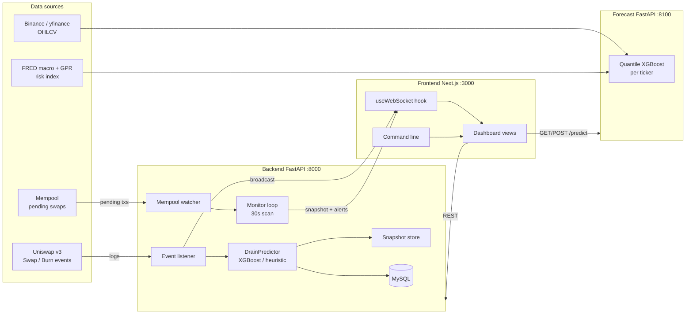
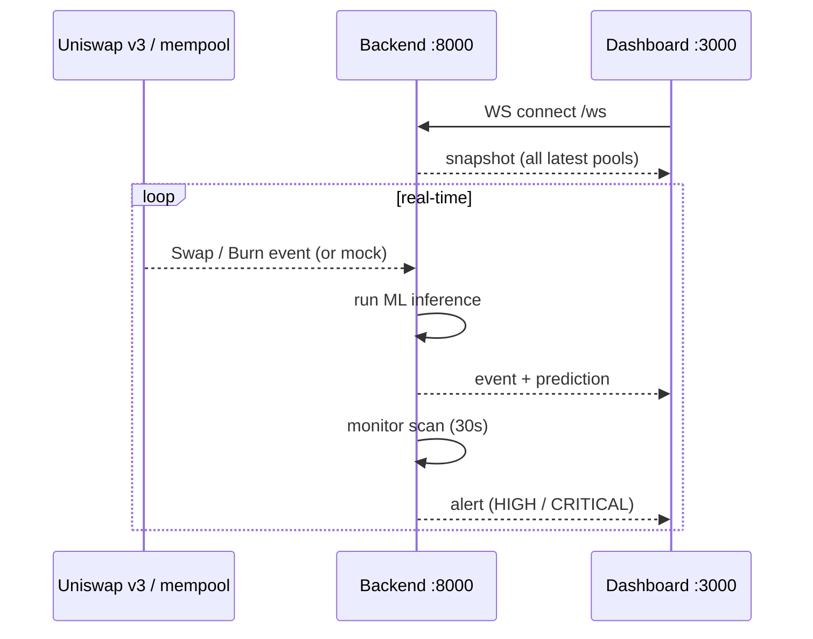
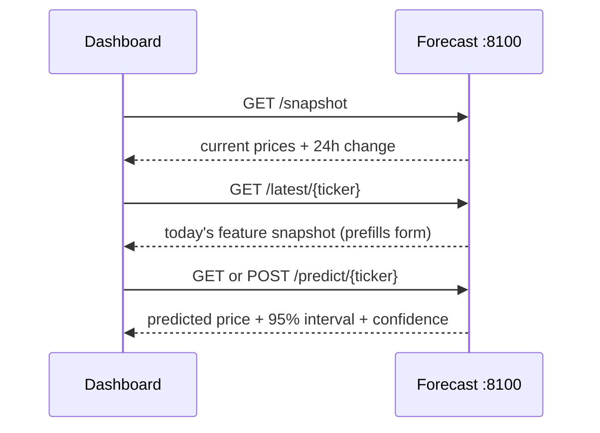

# DEX Liquidity Predictor

A **real-time DeFi risk dashboard** that watches Uniswap v3 liquidity pools,
predicts when liquidity is about to drain, measures the price impact of trades,
and forecasts next-day crypto prices with a machine-learning model — all in a
dark "Bloomberg terminal" style interface.

This repository is a teaching reference: it ties together **blockchain data,
financial mathematics, and machine learning** in a single small system, so it is
equally useful as a study aid, a thesis reference, or a starting point for a
trading-bot backend.

> **Disclaimer** — this is an educational/demonstration project, **not
> financial advice**. Predictions are statistical estimates of historical
> patterns and will not predict black-swan events.

---

## Table of contents

1. [What is this, in plain English?](#1-what-is-this-in-plain-english)
2. [The three services](#2-the-three-services)
3. [System architecture](#3-system-architecture)
4. [How data flows through the system](#4-how-data-flows-through-the-system)
5. [Deep dive — DEX backend (`backend/`)](#5-deep-dive--dex-backend-backend)
6. [Deep dive — price forecast (`crypto-forecast/`)](#6-deep-dive--price-forecast-crypto-forecast)
7. [Deep dive — dashboard (`frontend/`)](#7-deep-dive--dashboard-frontend)
8. [The machine-learning models](#8-the-machine-learning-models)
9. [WebSocket protocol](#9-websocket-protocol)
10. [REST API reference](#10-rest-api-reference)
11. [Project structure](#11-project-structure)
12. [Environment variables](#12-environment-variables)
13. [Running locally](#13-running-locally)
14. [Deploying to Apache/XAMPP](#14-deploying-to-apachexampp)
15. [Testing](#15-testing)
16. [Common gotchas](#16-common-gotchas)
17. [Glossary of concepts](#17-glossary-of-concepts)

---

## 1. What is this, in plain English?

Imagine you are a DeFi trader watching a Uniswap liquidity pool. Three things
matter to you:

1. **Is liquidity about to drain?** If providers pull their tokens out of the
   pool, the remaining depth gets thin and your trades slip more.
2. **How much will my trade move the price?** A big trade in a shallow pool
   produces large slippage ("price impact").
3. **What will BTC/ETH cost tomorrow?** For portfolio context.

This system answers all three:

- A **backend** service watches the pool (real blockchain or synthetic mock),
  feeds every trade/withdrawal through a **liquidity-drain ML model**, and
  pushes the result to your browser in real time over a **WebSocket**.
- A **forecast** microservice trains a **quantile XGBoost** model per coin and
  serves next-day price predictions with a confidence band.
- A **frontend** dashboard renders all of this as live tables, charts, alerts
  and a command line.

Nothing requires a blockchain node: the default **mock mode** generates
realistic synthetic data so the entire pipeline runs offline.

---

## 2. The three services

| Piece            | Path             | Runtime                | Port | Role                                        |
| ---------------- | ---------------- | ---------------------- | ---- | ------------------------------------------- |
| **Frontend**     | `frontend/`      | Next.js 14 + React 18  | 3000 | The dashboard you interact with             |
| **DEX backend**  | `backend/`       | FastAPI (uvicorn)      | 8000 | Watches pools, predicts drain, pushes alerts |
| **Forecast**     | `crypto-forecast/` | FastAPI (uvicorn)    | 8100 | Next-day price forecasting (quantile XGBoost) |

The folder also contains a Laravel skeleton, used **only** as a static file
server for Apache/XAMPP hosting. The real product is the three services above.

---

## 3. System architecture



---

## 4. How data flows through the system

### Pipeline A — blockchain → backend → WebSocket → frontend



1. The backend **listens** to `Swap` and `Burn` events on a Uniswap v3 pool
   (over a WebSocket RPC in real mode, or a synthetic generator in mock mode).
2. Every event is passed through a **liquidity predictor** that estimates the
   drain percentage and price impact, and assigns a risk level.
3. The result is **saved** (best-effort, to MySQL) and
   **broadcast** to every connected `/ws` client.
4. In parallel, a **monitor loop** samples each watched pool every 30 seconds,
   computes liquidity-change and volatility features, runs the drain
   classifier, and broadcasts alerts when risk is high.

### Pipeline B — frontend → forecast service



The forecast service fetches daily OHLCV plus macroeconomic series, aligns them,
runs a **quantile XGBoost** model, and returns the median next-day price plus a
confidence band.

---

## 5. Deep dive — DEX backend (`backend/`)

FastAPI + Web3.py + XGBoost. Its job is to **turn raw blockchain noise into a
risk signal**.

### Module map

| Module                                        | Responsibility                                                                 |
| --------------------------------------------- | ------------------------------------------------------------------------------ |
| `app/main.py`                                 | App entry point; CORS, exception handlers, lifespan tasks, `/ws` endpoint      |
| `app/core/config.py`                          | Typed settings loaded from environment / `.env`                                 |
| `app/core/container.py`                       | Dependency-injection container (lazy singletons)                               |
| `app/core/exceptions.py`                      | Exception hierarchy mapped to HTTP status codes                                |
| `app/core/security.py`                        | bcrypt password hashing (passlib)                                              |
| `app/core/logging.py`                         | Centralised logging config                                                     |
| `app/api/router.py`, `app/api/deps.py`        | REST router aggregation + in-process rate limiter                              |
| `app/api/routes/`                             | `health`, `pools`, `predictions`, `metrics`, `users` endpoints                 |
| `app/schemas/`                                | Pydantic request/response models                                               |
| `app/db/`                                     | SQLAlchemy models, schemas, session, CRUD (MySQL)             |
| `app/ml/features.py`                          | Fixed-order feature vector for the classifier                                  |
| `app/ml/model.py`                             | XGBoost classifier wrapper (train / save / load / predict)                     |
| `app/ml/predictor.py`                         | Chooses XGBoost vs heuristic; maps probability → alert level + message         |
| `app/services/web3_client.py`                 | Read-only Web3 provider manager + address validation                          |
| `app/services/pool_provider.py`               | On-chain vs mock pool state providers                                          |
| `app/services/price_impact.py`                | Uniswap v3 exact-input price-impact math                                       |
| `app/services/mempool.py`                     | Watches pending swap transactions, decodes selectors                          |
| `app/services/uniswap_events.py`              | Async Swap/Burn listener; decodes, predicts, broadcasts                        |
| `app/services/liquidity_predictor.py`         | Event-stream inference (`.pkl` model or deterministic mock)                    |
| `app/services/market_maker.py`                | Simulated AMM execution layer + financial metrics (Sharpe)                    |
| `app/services/store.py`                       | Thread-safe in-memory snapshot store                                          |
| `app/tasks/monitor.py`                        | Periodic scan loop (analytics + alerts)                                        |
| `app/websocket/manager.py`                    | Fan-out WebSocket connection manager                                           |
| `scripts/train_model.py`                      | Trains the drain classifier on synthetic data                                 |

### The monitoring pipeline

1. **Listen** — subscribe to a pool's `Swap` and `Burn` events (real: WebSocket
   RPC; mock: synthetic generator with the same payload shape).
2. **Decode** — parse each log into a readable object. Wei amounts are kept as
   strings above `2^53` so JavaScript doesn't lose integer precision.
3. **Predict** — `LiquidityPredictor` loads a serialized `.pkl` model when
   present, otherwise falls back to a deterministic mock inference.
4. **Store** — `save_metrics_to_db` writes the metric to MySQL
   (best-effort; the dashboard keeps working if the DB is offline). The
   historical-metrics endpoint falls back to the in-memory snapshot store when
   MySQL has no rows for a pool.
5. **Broadcast** — push the event + prediction to every `/ws` client.

### Price-impact mathematics (Uniswap v3)

The `PriceImpactService` replicates the Uniswap v3 core math in raw integer
units (wei / Q64.96), so it is overflow-safe and unit-testable without a node.

For a price encoded as `sqrtPriceX96`:

$$\text{raw price} = \left(\frac{\sqrt{P_{X96}}}{2^{96}}\right)^2
\qquad\qquad
\text{human price} = \text{raw} \cdot 10^{(\text{decimals}_0 - \text{decimals}_1)}$$

Swapping token0 → token1 (price moves **down**):

$$\sqrt{P_{new}} =
\frac{\sqrt{P_{old}} \cdot L \cdot 2^{96}}
{L \cdot 2^{96} + \Delta x \cdot \sqrt{P_{old}}}$$

Swapping token1 → token0 (price moves **up**):

$$\sqrt{P_{new}} = \sqrt{P_{old}} + \frac{\Delta y \cdot 2^{96}}{L}$$

Price impact is then reported as a signed percentage against the trader:

$$\text{impact} = \frac{P_{after} - P_{before}}{P_{before}} \times 100\%$$

A negative value means the trade moved the price against the trader (slippage).

### Market maker execution layer (`app/services/market_maker.py`)

The **execution** counterpart to the prediction pipeline. `MarketMakerBot` keeps
a simulated Uniswap v3 position and reacts to every prediction:

| Signal          | Position closed? | Action                                   |
| --------------- | ---------------- | ---------------------------------------- |
| HIGH / CRITICAL | no (open)        | `withdraw_liquidity()` (Burn)            |
| LOW             | yes (closed)     | `provide_liquidity()` (Mint)             |
| otherwise       | —                | hold                                     |

The position's tick range is dynamic — `calculate_optimal_ticks()` widens it
when predicted price impact is high (more volatility) and narrows it when low
(more concentrated). Real transactions are only built behind `SIMULATION_MODE`
(default on, logs only). State is exposed via `GET /api/v1/market-maker/status`
and pushed to the dashboard as a `bot` WebSocket frame.

#### Simulated financial performance

The bot also tracks a **simulated** P&L so the execution layer can be judged
quantitatively, not just by its open/closed state:

- `calculate_portfolio_value(current_price)` — net position value (USD), equal
  to the held assets' current value plus `accumulated_fees` minus any
  impermanent loss. Prices are token0 (USDC) denominated in token1 (WETH), so
  the USD value of the WETH leg is `amount1 / price`.
- `calculate_impermanent_loss(current_price)` — constant-product AMM loss
  versus simply holding, with `r = current / entry`:

$$\text{IL} = \text{hodl} \cdot \left(1 - \frac{2\sqrt{r}}{1 + r}\right)$$

- `calculate_sharpe_ratio(risk_free_rate=0.0)` — annualised Sharpe ratio over
  the recorded `portfolio_history`, using period-over-period percentage
  returns. Returns `0.0` when there aren't at least two returns or the return
  volatility is zero. The formula used is:

$$\text{Sharpe Ratio} = \frac{R_p - R_f}{\sigma_p}$$

  **where:**

  - $R_p$ = return of the portfolio
  - $R_f$ = risk-free rate
  - $\sigma_p$ = standard deviation of the portfolio's excess return

- `record_portfolio_value()` — appends `{timestamp, net_portfolio_value}` on
  every evaluation (monitor scan or streamed Swap/Burn event), accruing a small
  simulated trading fee while a position is open.

`GET /api/v1/market-maker/status` exposes all of these as `accumulated_fees`,
`current_impermanent_loss`, `net_portfolio_value`, and `sharpe_ratio`.

---

## 6. Deep dive — price forecast (`crypto-forecast/`)

A supervised ML microservice answering: *"what will BTC, ETH, SOL, BNB or XRP
cost tomorrow?"*

### Module map

| Module            | Responsibility                                                                 |
| ----------------- | ------------------------------------------------------------------------------ |
| `config.py`       | Tickers, feature columns, FRED series, split, seed                             |
| `data_source.py`  | Fetch crypto OHLCV (Binance → yfinance), macro (FRED → yfinance), GPR index    |
| `features.py`     | Target construction + aligned feature matrix                                   |
| `model.py`        | Quantile XGBoost registry: train, evaluate, persist, predict with uncertainty  |
| `schemas.py`      | Pydantic request/response models                                               |
| `main.py`         | FastAPI service (`/health`, `/latest`, `/snapshot`, `/predict`)                |
| `train.py`        | CLI training entry point                                                        |

### Data pipeline

1. **Crypto OHLCV** — pulled from the Binance public klines API (falls back to
   Yahoo Finance).
2. **Macro series** — S&P 500, DXY (US Dollar Index), gold, 10-year Treasury
   yield. FRED is preferred when `FRED_API_KEY` is set; yfinance otherwise.
3. **Geopolitical risk** — the GPR index from the authors' hosted file.
4. **Alignment** — all series are concatenated on a union date index and
   **forward-filled** to close weekend/holiday gaps in the traditional-market
   series; rows without a crypto close are dropped.

### Feature engineering

| Group        | Series                                                            |
| ------------ | ----------------------------------------------------------------- |
| Crypto       | `open, high, low, close, volume` (per ticker)                     |
| Equities     | `sp500_close` (S&P 500)                                           |
| Macro        | `dxy`, `gold`, `treasury_10y`                                     |
| Geopolitical | `gpr` (Geopolitical Risk index)                                   |

The **target** is the next-day close: `target = close.shift(-1)`. The train/test
split is **chronological 80/20** (no shuffling) so the model is only ever
evaluated on strictly future data — this is critical for avoiding look-ahead
bias in a time-series setting.

### Quantile XGBoost + uncertainty

Instead of predicting a single number, the model is trained with the
`reg:quantileerror` objective at three quantiles:

$$\text{quantiles} = [0.025,\ 0.5,\ 0.975]$$

- The **median** (0.5) is the headline point forecast.
- The **2.5th and 97.5th percentiles** give a 95% predictive interval.

The reported interval is `ŷ ± 1.96·RMSE`, and the confidence is how tight that
band is relative to the price level:

$$\text{confidence} = 100 \times \left(1 - \frac{1.96 \cdot \text{RMSE}}{\hat y}\right)$$

(If no RMSE is available, the quantile bounds themselves are used.)

---

## 7. Deep dive — dashboard (`frontend/`)

Built with **Next.js 14** (App Router) + **React 18** + **Tailwind CSS** +
**lightweight-charts**. It is a single page with a sidebar; clicking a nav item
swaps the main content area. No routing, no server — the whole thing compiles to
static files.

### Views

- **Dashboard** — live pool snapshot, price, liquidity, risk, event log.
- **Pools** — list of watched pools + historical liquidity chart.
- **Predictions** — latest drain/price-impact calls per event.
- **Price Prediction** — a form (prefilled with today's real data) asking the
  forecast service for tomorrow's price, with confidence and a 95% range.
- **Alerts** — warnings that crossed a risk threshold.
- **Settings** — WebSocket/API URLs, connection status, theme picker.

### Key components

| Component                 | Role                                                             |
| ------------------------- | ---------------------------------------------------------------- |
| `Sidebar.tsx`             | Navigation + embedded market monitor + WS status indicator       |
| `MarketMonitor.tsx`       | Live ticker table (polls `/snapshot` every 30 s)                 |
| `PricePredictionView.tsx` | The forecast UI, incl. a "how the math works" explainer          |
| `LiquidityChart.tsx`      | TradingView area chart (updates imperatively to avoid re-renders)|
| `CommandLine.tsx`         | Terminal input: `PRED SOL`, `TICKERS`, `HELP`, `CLEAR`           |
| `AlertBanner.tsx`         | High-contrast banner on HIGH/CRITICAL risk                       |

### The WebSocket hook

`hooks/useWebSocket.ts` is a small, reusable client:

- Connects to `NEXT_PUBLIC_WS_URL` (default `ws://localhost:8000/ws`).
- Parses each frame as a `WSMessage` and keeps a bounded buffer of 200.
- **Auto-reconnects** with exponential backoff (1 s → 2 s → … capped at 15 s).
- Exposes `{ status, lastMessage, messages, send }`.

`app/page.tsx` derives `pools`, `events`, and `alerts` from that buffer with
`useMemo`, which is why the numbers tick without a page refresh.

### The "Noir" theme

The UI uses CSS variables (`--noir-accent`, `--noir-panel`, …) so the accent
color swaps at runtime. `ThemeProvider` persists the choice to `localStorage`,
and an inline pre-hydration script in `layout.tsx` applies it before React
mounts (no flash).

---

## 8. The machine-learning models

There are **two** ML systems plus a **heuristic fallback**:

### 8.1 Liquidity-drain classifier (`backend/app/ml`)

- **Model:** `XGBClassifier` —
  `n_estimators=200, max_depth=4, learning_rate=0.05, subsample=0.8,
  colsample_bytree=0.8, eval_metric="logloss"`.
- **Features (fixed order, 8):**
  1. `liquidity_change_pct_1m`
  2. `liquidity_change_pct_5m`
  3. `liquidity_change_pct_15m`
  4. `reference_impact_pct` (impact of a $100k reference trade)
  5. `pending_swaps` (mempool)
  6. `fee_tier`
  7. `log_liquidity` (`log10(liquidity)`)
  8. `price_volatility_5m`
- **Training data:** synthetic (20k rows) generated by `scripts/train_model.py`
  with a logistic risk model driven by negative liquidity changes, impact,
  pending swaps, and volatility.
- **Output:** positive-class (drain) probability → alert level:
  `≥0.8` CRITICAL, `≥0.6` HIGH, `≥0.3` MEDIUM, else LOW.

**Heuristic fallback** (used when no model file exists): an additive score from
liquidity-change buckets (+0.50 / +0.35 / +0.15), impact buckets
(+0.30 / +0.20 / +0.10), pending swaps (+0.10 / +0.05), and volatility (+0.05),
capped at 0.95. This keeps the pipeline transparent and runnable with no model.

### 8.2 Event-stream inference (`backend/app/services/liquidity_predictor.py`)

Runs on each live Swap/Burn event. Tries a `.pkl` model; otherwise uses a
deterministic mock:

$$\text{utilization} = \frac{\text{swap volume}}{\text{reserve depth}}$$

$$\text{price impact} = \min(\text{utilization} \times 100,\ 100)$$

$$\text{drain} = \text{utilization} \times 100 \times 0.6 + \text{gas pressure} \times 30 \ (+5 \text{ on Burn})$$

Risk level: `max(drain, impact) ≥ 20 → High; ≥ 8 → Medium; else Low`.

### 8.3 Crypto price forecast (`crypto-forecast/model.py`)

- **Model:** quantile `XGBRegressor` —
  `objective="reg:quantileerror", quantile_alpha=[0.025, 0.5, 0.975],
  n_estimators=300, max_depth=5, learning_rate=0.05, subsample=0.9,
  colsample_bytree=0.9, tree_method="hist"`.
- **Evaluation:** MAE, RMSE, R² on the held-out median prediction.
- **Uncertainty:** as described in section 6.

---

## 9. WebSocket protocol

Endpoint: `ws://localhost:8000/ws` — server is **push-only** (inbound client
messages are ignored).

| Direction                | Frame type | Payload                                                                                    |
| ------------------------ | ---------- | ------------------------------------------------------------------------------------------ |
| Server → client (connect)| `snapshot` | `{"type":"snapshot","data":[PoolState, …]}`                                                |
| Server → client (event)  | `event`    | `{"type":"event","event":"Swap"\|"Burn","pool","pair","transaction_hash","block_number","args":{…},"prediction":{…},"raw":{…},"timestamp"}` |
| Server → client (alert)  | `alert`    | `{"type":"alert","level":"LOW"\|"MEDIUM"\|"HIGH"\|"CRITICAL","pool_address","pair","message","drain_probability","liquidity_change_pct","price_impact_pct","timestamp"}` |

- Integers above `2^53` are serialized as **strings** to preserve JS precision.
- The client reconnects automatically with exponential backoff (capped at 15 s).

---

## 10. REST API reference

### Backend (`:8000`, prefix `/api/v1`)

| Method | Path                               | Request                          | Response                                             |
| ------ | ---------------------------------- | -------------------------------- | ---------------------------------------------------- |
| GET    | `/health`                          | —                                | `HealthResponse` (status, mock_mode, web3_connected) |
| GET    | `/pools`                           | —                                | `{"count", "pools": [PoolState…]}`                   |
| GET    | `/pools/{address}`                 | —                                | `PoolSnapshot` or 404                                |
| GET    | `/pools/{address}/history`         | `limit` (1–2000, default 100)    | `{"pool", "history": […]}`                           |
| POST   | `/pools/{address}/price-impact`    | `PriceImpactRequest` (rate-limited) | `PriceImpactResponse`                              |
| GET    | `/predictions`                     | —                                | `{"count", "predictions"}`                           |
| GET    | `/predictions/{address}`           | — (rate-limited)                 | `PredictionResponse{prediction: DrainPrediction}`    |
| GET    | `/metrics/{pool_address}`          | `time_range` (`1h\|24h\|7d`)     | `[MetricPoint{time, value}]` ascending               |
| POST   | `/users/register`                  | `UserCreate`                     | `UserResponse` (201) / 409                           |
| GET    | `/market-maker/status`             | —                                | `MarketMakerStatus` (position + financial metrics)   |

### Forecast (`:8100`)

| Method | Path                  | Request                         | Response                                              |
| ------ | --------------------- | ------------------------------- | ----------------------------------------------------- |
| GET    | `/health`             | —                               | `{"status","models_loaded","tickers"}`                |
| GET    | `/latest/{ticker}`    | —                               | `{"ticker","as_of","features":{…}}` (503 on failure)  |
| GET    | `/snapshot`           | —                               | per-ticker `{price, change_24h}` + macro fields       |
| GET    | `/predict/{ticker}`   | —                               | forecast from the latest row (404 if no model)        |
| POST   | `/predict/{ticker}`   | `PredictRequest` (10 features)  | `PredictResponse` (price, interval, confidence, R²…)  |

---

## 11. Project structure

```
dex-liquidity-predictor/
├── start-all.ps1        # one-command launcher (all three services)
├── backend/             # FastAPI DEX service (events → ML → alerts)
│   ├── app/
│   │   ├── main.py      # entry point, CORS, /ws
│   │   ├── api/         # REST routes + rate limiter
│   │   ├── core/        # config, container, exceptions, logging, security
│   │   ├── db/          # SQLAlchemy models, schemas, session, CRUD
│   │   ├── ml/          # features, XGBoost model, predictor
│   │   ├── schemas/     # Pydantic models
│   │   ├── services/    # web3, pool provider, price impact, events, store
│   │   ├── tasks/       # monitor loop
│   │   └── websocket/   # connection manager
│   ├── scripts/train_model.py
│   └── tests/
├── crypto-forecast/     # per-ticker next-day price forecast service
│   ├── config.py
│   ├── data_source.py   # Binance → yfinance / FRED / GPR
│   ├── features.py
│   ├── model.py         # quantile XGBoost registry + uncertainty
│   ├── main.py          # FastAPI endpoints
│   ├── train.py         # CLI training
│   ├── schemas.py
│   ├── data/            # cached raw data
│   └── models/          # {TICKER}_xgb.json + {TICKER}_meta.json
├── frontend/            # Next.js dashboard (the UI)
│   ├── app/             # layout + page
│   ├── components/      # Sidebar, charts, views, theme, command line
│   ├── hooks/           # useWebSocket, useHistoricalMetrics
│   └── lib/             # types, format, themes
├── public/              # what Apache/XAMPP actually serves (static export)
└── ... (Laravel scaffold used only for hosting)
```

---

## 12. Environment variables

| File                       | Variables                                                                         |
| -------------------------- | --------------------------------------------------------------------------------- |
| `backend/.env.example`     | `MOCK_MODE`, `RPC_URL_HTTP`, `RPC_URL_WS`, `DATABASE_URL`, `UNISWAP_V3_POOL_ETH_USDC`, `LIQUIDITY_MODEL_PATH`, `CORS_ORIGINS` |
| `crypto-forecast/.env.example` | `FRED_API_KEY` (optional), `BINANCE_BASE_URL` (optional)                       |
| `frontend/.env.example`    | `NEXT_PUBLIC_WS_URL`, `NEXT_PUBLIC_API_URL`, `NEXT_PUBLIC_FORECAST_URL`           |

> **Note on `CORS_ORIGINS`:** it is a JSON list — e.g.
> `CORS_ORIGINS=["http://localhost:3000","http://127.0.0.1:3000","http://localhost","http://127.0.0.1"]` —
> because pydantic-settings v2 requires JSON for list fields. Keep the port-80
> origins (`http://localhost` / `http://127.0.0.1`) when serving the static
> export from `public/` (section 14), otherwise the browser blocks REST calls
> such as the historical-metrics fetch.

---

## 13. Running locally

### One command (recommended)

From the project root:

```powershell
powershell -ExecutionPolicy Bypass -File .\start-all.ps1
```

This opens three windows (backend :8000, forecast :8100, dashboard :3000).
Open http://localhost:3000. Close the windows (or Ctrl+C) to stop.

The launcher is **self-healing**: it verifies each service's Python
dependencies, creates or repairs a per-service `.venv` (running
`pip install -r requirements.txt`) when anything is missing, and copies the
`.env` files from their examples if they don't exist. Use `-Setup` only to
force a full reinstall (Python requirements + `npm install`):

```powershell
powershell -ExecutionPolicy Bypass -File .\start-all.ps1 -Setup
```

> Requires Python 3.11+ and Node.js.

### Manual (three terminals)

```powershell
# 1. Backend (port 8000)
cd backend
python -m venv .venv
.venv\Scripts\activate
pip install -r requirements.txt
copy .env.example .env
python -m uvicorn app.main:app --reload --port 8000

# 2. Forecast (port 8100)
cd ..\crypto-forecast
pip install -r requirements.txt
python train.py --all          # trains BTC, ETH, SOL, BNB, XRP
python -m uvicorn main:app --host 127.0.0.1 --port 8100

# 3. Dashboard (port 3000)
cd ..\frontend
npm install
copy .env.example .env.local
npm run dev
```

### Run without a blockchain node

`MOCK_MODE=true` (the default) makes the backend generate synthetic pool, price
and mempool data, so the whole dashboard runs offline. Set `MOCK_MODE=false` and
fill in `RPC_URL_HTTP` / `RPC_URL_WS` to watch mainnet.

---

## 14. Deploying to Apache/XAMPP

The dashboard is a static export, so it builds to plain HTML/JS copied into
`public/`:

```powershell
cd frontend
npm run build
$pub = "..\public"
if (Test-Path "$pub\_next") { Remove-Item "$pub\_next" -Recurse -Force }
Copy-Item "out\index.html","out\404.html" -Destination $pub -Force
Copy-Item "out\_next" -Destination $pub -Recurse -Force
```

Then visit `http://localhost/dex-liquidity-predictor/public/`.

> Make sure `backend/.env` includes `http://localhost` and `http://127.0.0.1`
> in `CORS_ORIGINS`. The static export's browser origin is `http://localhost`
> (port 80); without it in the allow-list the browser blocks REST calls to
> `:8000` (the WebSocket still works, but historical metrics / forecasts show
> "unavailable").

---

## 15. Testing

```powershell
# Backend unit tests (price-impact math + liquidity predictor)
cd backend
.venv\Scripts\python.exe -m pytest
```

`backend/tests/test_price_impact.py` verifies the Uniswap v3 math (price
round-trips, direction, magnitude, zero-liquidity guard).
`backend/tests/test_liquidity_predictor.py` verifies the mock inference path
(shape, larger trade ⇒ higher impact, Burn boosts drain).

---

## 16. Common gotchas

- **"Forecast service unreachable"** — the `crypto-forecast` service isn't
  running, or its models were never trained. Train + start it.
- **Dashboard stays "LINKING"** — the backend isn't up on :8000, or
  `NEXT_PUBLIC_WS_URL` is wrong. Check `ws://localhost:8000/ws`.
- **Backend crashes on startup with `SettingsError: cors_origins`** — your
  `.env` has a comma-separated CORS list; use JSON (see section 12).
- **Backend needs MySQL?** — no. It starts fine without a database; historical
  metrics fall back to the in-memory snapshot store when MySQL is offline or
  has no rows, so the dashboard works end-to-end in mock mode. MySQL is only
  for persistence across restarts.
- **"Historical data unavailable — start backend + MySQL"** — either the
  backend isn't running on :8000, or (when using the static export from
  `public/`) `CORS_ORIGINS` is missing the `http://localhost` /
  `http://127.0.0.1` origins (sections 12 and 14).
- **Pools view stuck on "Awaiting pool data from server…"** — the backend
  re-sends the pool snapshot after every monitor scan (30s), so wait a moment
  or refresh. If it persists, the backend WebSocket isn't reachable.
- **`npm`/`npm.cmd` not recognized in an old terminal** — Node was installed
  after that terminal opened. Open a new terminal (or run `start-all.ps1`,
  which refreshes PATH).
- **Frontend changes don't show up** — re-run `npm run build` and copy `out/`
  into `public/`, or use `npm run dev` for faster iteration.

---

## 17. Glossary of concepts

- **Automated Market Maker (AMM)** — a smart contract that trades tokens
  algorithmically against a pool of liquidity instead of an order book.
- **Liquidity pool** — a pot of two tokens (e.g. USDC/WETH) that traders swap
  against; providers earn fees for supplying it.
- **Liquidity drain** — providers withdrawing tokens, thinning the pool and
  increasing slippage.
- **Price impact / slippage** — how much a trade moves the price; a large trade
  in a shallow pool moves it more.
- **TVL** — Total Value Locked, the dollar value of assets in a pool.
- **Uniswap v3** — the third AMM iteration; uses **concentrated liquidity**
  within tick ranges and a Q64.96 fixed-point price.
- **Q64.96** — a fixed-point format: the `sqrtPriceX96` integer represents the
  square root of the price times `2^96`.
- **Mempool** — the set of pending (not yet mined) transactions.
- **XGBoost** — a gradient-boosted decision-tree library.
- **Quantile regression** — instead of the conditional mean, it estimates a
  conditional quantile (e.g. the median, or the 2.5th/97.5th percentile),
  giving a full predictive distribution.
- **Forward fill (`ffill`)** — carrying the last observed value forward to close
  gaps in a time series (e.g. weekend days missing from stock data).
- **Look-ahead bias** — accidentally training on data from the future; avoided
  here with a chronological (non-shuffled) split and `shift(-1)` targets.
- **WebSocket** — a persistent, bidirectional connection used to push real-time
  updates to the browser without polling.

---

*Educational project. Not financial advice.*
