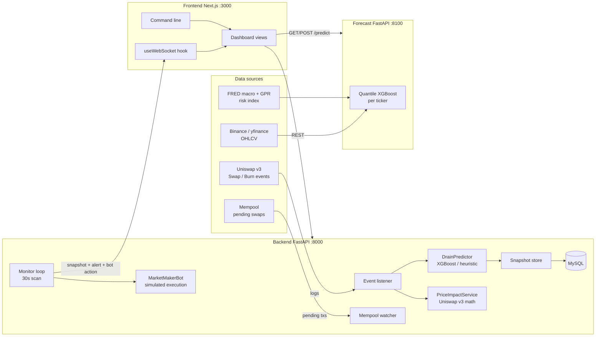
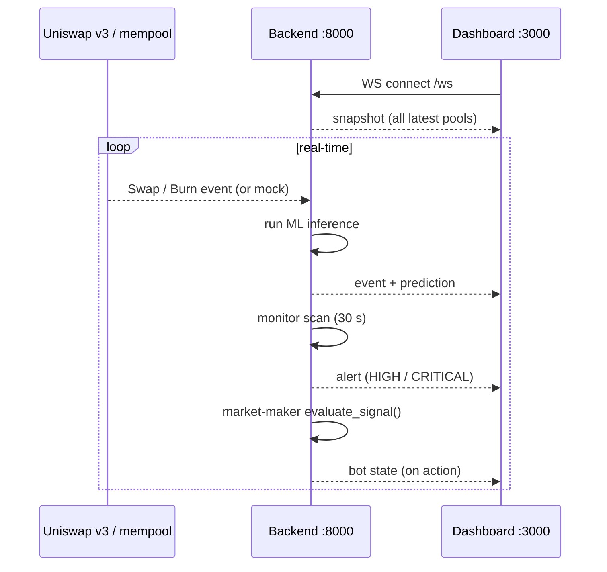
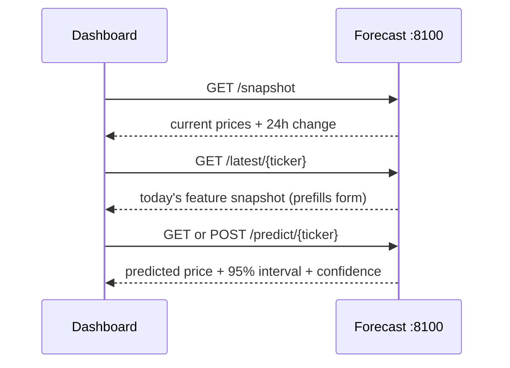

# 02 — System Architecture

## 1. Overview

The system is a **real-time decentralized-finance (DeFi) risk analytics
platform** composed of three cooperating services plus a thin static-hosting
layer:

| Piece | Path | Runtime | Port | Role |
| --- | --- | --- | --- | --- |
| **DEX backend** | `backend/` | FastAPI (Uvicorn) | 8000 | Watches pools, predicts liquidity drain & price impact, drives the market-maker bot |
| **Forecast service** | `crypto-forecast/` | FastAPI (Uvicorn) | 8100 | Next-day price forecasting (quantile XGBoost) |
| **Dashboard** | `frontend/` | Next.js 14 + React 18 | 3000 | The UI (live tables, charts, alerts, command line) |
| **Static host** | `public/` (Laravel skeleton) | Apache/XAMPP | — | Serves the compiled dashboard as static files |

The **Laravel skeleton** in the repository root exists only to serve the
compiled static export under Apache/XAMPP. It contains no domain logic; the
product is the three services above.

## 2. Architectural diagram

## 3. Data-flow pipelines

### Pipeline A — blockchain → backend → WebSocket → frontend

1. The backend **listens** to `Swap` and `Burn` events on a Uniswap v3 pool
   (WebSocket RPC in real mode; a synthetic generator in mock mode).
2. Each event passes through `LiquidityPredictor`, which estimates drain
   percentage and price impact and assigns a risk level.
3. Results are **stored** (best-effort to MySQL) and **broadcast** to every
   `/ws` client.
4. In parallel, `MonitorService` samples each watched pool every 30 seconds,
   computes liquidity-change/volatility features, runs `DrainPredictor`, emits
   alerts, and forwards each prediction to the `MarketMakerBot`.

### Pipeline B — frontend → forecast service

## 4. Backend module map (`backend/app/`)

| Module | Responsibility |
| --- | --- |
| `main.py` | FastAPI app, CORS, exception handlers, `/ws` endpoint |
| `api/router.py` | Aggregates the REST routers under `/api/v1` |
| `api/routes/` | `health`, `pools`, `predictions`, `metrics`, `market_maker`, `users` |
| `core/config.py` | Pydantic-settings `Settings` (env-driven) |
| `core/container.py` | Dependency-injection container (singletons) |
| `core/security.py` | Password hashing (bcrypt) |
| `core/exceptions.py` | `AppError` hierarchy → clean JSON errors |
| `ml/features.py` | Fixed 8-feature vector (shared by train & inference) |
| `ml/model.py` | `XGBDrainModel` wrapper (load/save/fit/predict_proba) |
| `ml/predictor.py` | `DrainPredictor` (XGBoost or heuristic) |
| `services/price_impact.py` | Uniswap v3 exact-input swap math |
| `services/liquidity_predictor.py` | Event-stream ML inference (`.pkl` or mock) |
| `services/market_maker.py` | `MarketMakerBot` reactive execution layer |
| `services/web3_client.py` | Ethereum RPC reads + mempool subscription |
| `services/pool_provider.py` | Pool state fetch (real or mock) |
| `services/mempool.py` | Pending-swap tracking |
| `services/store.py` | In-memory snapshot/prediction store |
| `services/uniswap_events.py` | Swap/Burn log decoding |
| `tasks/monitor.py` | 30 s background scan loop |
| `websocket/manager.py` | WebSocket connection manager |
| `db/` | SQLAlchemy models + MySQL access (optional) |

## 5. Forecast module map (`crypto-forecast/`)

| Module | Responsibility |
| --- | --- |
| `config.py` | Tickers, feature columns, FRED/yfinance series, split, seed |
| `data_source.py` | Binance→yfinance OHLCV, FRED→yfinance macro, GPR fetch + caching |
| `features.py` | Target construction (`shift(-1)`) + aligned feature matrix |
| `model.py` | Quantile XGBoost train/evaluate/persist/predict-with-uncertainty |
| `schemas.py` | Pydantic request/response models |
| `main.py` | FastAPI app (`/health`, `/snapshot`, `/latest`, `/predict`) |
| `train.py` | End-to-end training CLI |

## 6. Frontend module map (`frontend/`)

| Component | Role |
| --- | --- |
| `app/page.tsx` | Dashboard page (sidebar + content area) |
| `components/Sidebar.tsx` | Navigation + connection status |
| `components/MarketMonitor.tsx` | Live ticker table (polls `/snapshot`) |
| `components/PricePredictionView.tsx` | Forecast UI + "how the math works" explainer |
| `components/LiquidityChart.tsx` | TradingView-style area chart |
| `components/MarketMakerPanel.tsx` | Bot position state (WS `bot` + REST poll) |
| `components/CommandLine.tsx` | Terminal input (`PRED`, `TICKERS`, `HELP`, `CLEAR`) |
| `components/AlertBanner.tsx` | HIGH/CRITICAL warning banner |
| `hooks/useWebSocket.ts` | WS client with exponential-backoff reconnect |
| `hooks/useHistoricalMetrics.ts` | Historical liquidity metrics fetch |
| `lib/types.ts` | TypeScript mirrors of backend Pydantic schemas |

## 7. Resilience & degradation

- **No node?** `MOCK_MODE=true` generates synthetic pools/events offline.
- **No trained model?** `DrainPredictor` and `LiquidityPredictor` fall back to
  deterministic heuristics/mock inference.
- **No MySQL?** DB writes fail silently; the dashboard keeps working in-memory.
- **No FRED key?** The forecast pipeline falls back to `yfinance` proxies.
- **Real trading disabled?** `SIMULATION_MODE=true` (default) never signs a
  transaction; the bot only logs simulated Mint/Burn actions.
